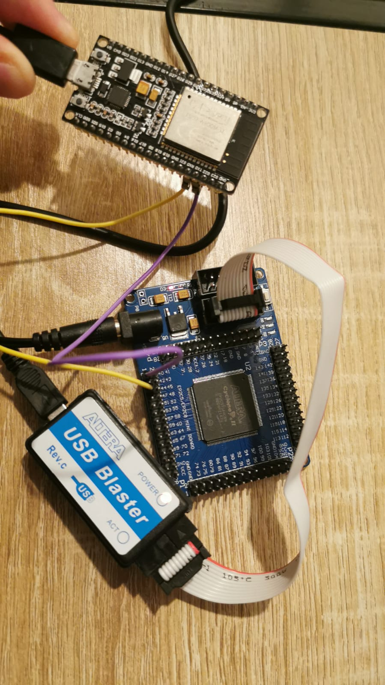

# Altera-Cyclone-II-UART-Communication

## Description
This repository contains code and resources for establishing UART communication between an Altera Cyclone II FPGA board and an ESP32 microcontroller. UART (Universal Asynchronous Receiver/Transmitter) communication is a widely used serial communication protocol for exchanging data between digital devices.

## Setup Image
<p align="center">
    
</p>

## Contents
1. **Quartus II Project**: Includes the Quartus II project files for configuring the Altera Cyclone II FPGA.
2. **ESP32 Code**: Contains the code for UART communication on the ESP32 microcontroller.
3. **README.md**: Instructions and information about the repository.

## Prerequisites
- Altera Cyclone II FPGA board.
- ESP32 microcontroller.
- Quartus II software installed on your computer.
- ESP32 development environment set up on your computer.

## Setup Instructions
1. **Clone the Repository**: Clone this repository to your local machine using the following command:

```bash
git clone https://github.com/your-username/Altera-Cyclone-II-UART-Communication.git
```

2. **Set Up Quartus II Project**:
- Open the Quartus II project file located in the `Quartus II Project` directory.
- Compile the project and generate the programming file for your FPGA board.

3. **Upload Arduino Sketch**:
- Open the Arduino sketch file located in the `Arduino Sketch` directory.
- Upload the sketch to your Arduino microcontroller using the Arduino IDE.

4. **Connect Hardware**:
- Connect the Altera Cyclone II FPGA board to your computer via USB.
- Connect the Arduino microcontroller to your computer via USB.
- Ensure proper power supply for both devices.

5. **Configure UART Settings**:
- Ensure that the UART settings (baud rate, parity, etc.) are consistent between the FPGA and Arduino code.

6. **Run the System**:
- Power on both the FPGA board and the Arduino.
- Verify that UART communication is established between the two devices.
- Test sending and receiving data to ensure proper functionality.

## Contributing
Contributions to this repository are welcome. Feel free to submit pull requests or open issues for any improvements, bug fixes, or additional features.

## License
This project is licensed under the MIT License - see the [LICENSE](LICENSE) file for details.

## Acknowledgments
- [Altera](https://www.intel.com/content/www/us/en/products/programmable/fpga/cyclone-series.html) for providing resources and documentation on the Cyclone II FPGA.
- Contributors to UART communication libraries and tutorials for ESP32.
